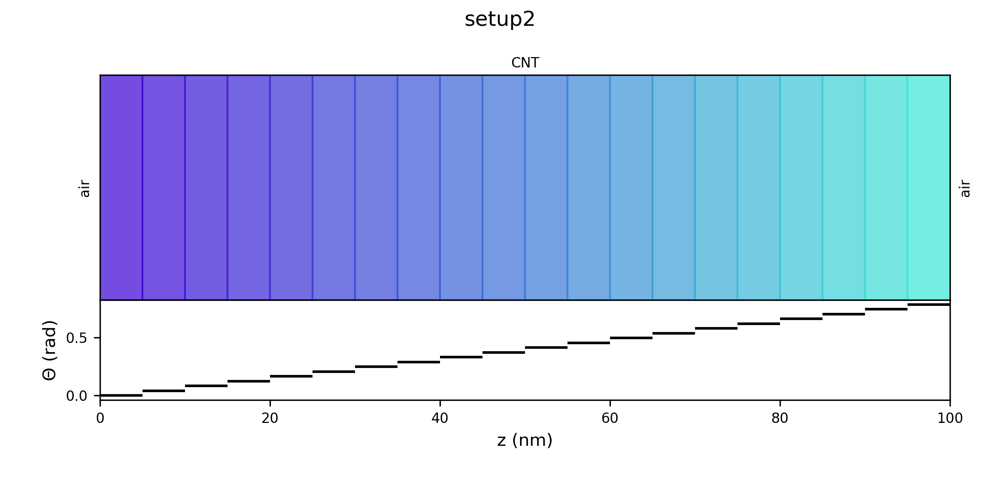

# Transfer matrix method tool (tmm-tool)

This tool implements the transfer matrix method (TMM) to describe the propagation of electromagnetic (EM) waves in stacked layered materials at normal incidence. It uses a 4x4 matrix formalism which can account for the propagation of the EM fields with both x and y components. The EM waves are described using the [Jones vector formalism](https://en.wikipedia.org/wiki/Jones_calculus). This allows the user to study the behaviour of the system with respect to the polarisation of light. Also, any layer can be arbitrary rotated by a given angle, thus allowing to study complex responses such as linear and/or circular [dichroism](https://en.wikipedia.org/wiki/Dichroism).

## Installation

## Usage

## Output

## Roadmap

The project is stable enough to deserve a release and offers the basic capabilities of the transfer matrix method. However, several improvements are on the making and will include:
 - a more efficient and versatile input file for scripting;
 - a routine to perform the removal of echos between layers;
 - a routine to calculate linear and circular dichroism;
 - the possibility of using different unit of measures (wavelength vs. frequency vs. energy);
 - an integration with the [RefractiveIndex](https://refractiveindex.info/) database, which provides the necessary optical constants.

## Support

For any problems, questions or suggestions, please contact me at tenobaldi@gmail.com.

## Authors and acknowledgment

The development of this tool is proudly powered by [me](https://github.com/t3n0).
Also, please consider citing the relevant literature if you are going to use this tool:
 - [Phys. Rev. B 104, 155437 (2021)](https://doi.org/10.1103/PhysRevB.104.155437)
 - [J Infrared Milli Terahz Waves 42, 1142–1152 (2021)](https://doi.org/10.1007/s10762-021-00815-5)

## License

This program is free software: you can redistribute it and/or modify it under the terms of the GNU General Public License as published by the Free Software Foundation, either version 3 of the License, or (at your option) any later version.

This program is distributed in the hope that it will be useful, but WITHOUT ANY WARRANTY; without even the implied warranty of MERCHANTABILITY or FITNESS FOR A PARTICULAR PURPOSE.  See the GNU General Public License for more details.

You should have received a copy of the GNU General Public License along with this program.  If not, see <https://www.gnu.org/licenses/>.
